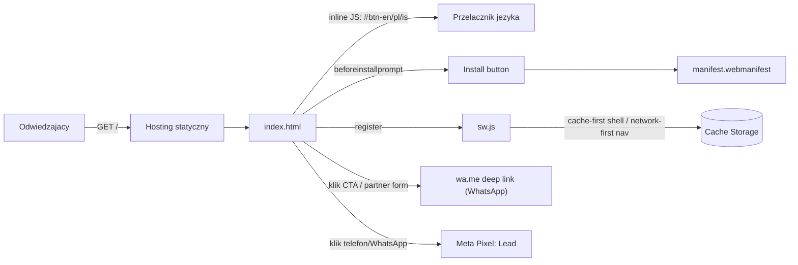

# ARCHITECTURE — mas-garage

## Co to jest (3 zdania)
Trójjęzyczna (EN/PL/IS) strona lądowania + instalowalna PWA dla warsztatu Mountain Car Garage
w Reykjanesbær. Zero backendu i zero bazy danych — jedyny cel strony to zamienić odwiedzającego
w wiadomość WhatsApp (rezerwacja serwisu, zapis do partner clubu). Płaci MAS Group (Kamil Jan),
produkt jest darmowy dla klienta końcowego.

## Stack (boring, z wersjami — z package.json)
- Frontend: 1 plik `index.html` (~1870 linii) — czysty HTML5 + inline CSS + inline vanilla JS.
  Brak frameworka i brak bundlera świadomie (patrz `docs/adr/0001-static-html-no-build-step.md`).
- Offline/installability: `sw.js` (service worker, network-first dla nawigacji, cache-first dla
  shellu) + `manifest.webmanifest` (`id: "/"`, ikony maskable).
- Tooling: TypeScript 7 tylko dla `playwright.config.ts` i `e2e/*.ts` (sam `index.html` nie jest
  typowany — to zwykły HTML). `tsc -b` sprawdzany w CI.
- Lint: `html-validate` 11 na `index.html` (reguły luzowane w `.htmlvalidate.json`: inline style,
  `tel:` non-breaking, void-style — świadome wyjątki dla contact-linków).
- Testy: Playwright 1.62 (`e2e/smoke.spec.ts`) — jedyny sposób, by bramka CI faktycznie coś
  sprawdzała (patrz sekcja "Testy" w README: bez `package.json`/`playwright.config.ts` kroki CI
  pomijały się po cichu).
- Hosting/deploy: **[NIEPEWNE]** — w repo nie ma `vercel.json`, `netlify.toml`, `CNAME` ani
  workflow `deploy*.yml`, więc mechanizm wdrożenia `garage.mountaincar.is` nie jest widoczny z kodu
  (prawdopodobnie panel hostingu podpięty bezpośrednio do repo). Zweryfikuj w panelu hostingu
  przed pierwszym incydentem — patrz `docs/RUNBOOK.md`.
- Analytics: Meta Pixel (`fbq`) — zdarzenie `Lead` na klik w link WhatsApp/telefon.

## Moduły i granice (co jest gdzie)
| Plik/katalog | Odpowiedzialność | Tier |
|---|---|---|
| `index.html` | cała treść, przełącznik języka, logika instalacji PWA, formularz partner clubu (buduje link `wa.me`), Meta Pixel | T1 |
| `sw.js` | cache offline shellu, strategie fetch | T1 |
| `manifest.webmanifest` | metadane instalacji (ikony, `start_url`, `id`) | T1 |
| `e2e/smoke.spec.ts` | jedyny realny dowód, że i18n/PWA/SW działają | T1 |
| `playwright.config.ts` | serwuje katalog statyczny na `:4173`, uruchamia Chromium | — |
| `.htmlvalidate.json` | reguły lintu HTML | — |

Brak `src/`, brak API, brak `supabase/`, brak sekretów — cała "logika biznesowa" to link `wa.me`
z zaszytym numerem telefonu i tekstem wiadomości per język.

## Przepływ danych (diagram)

## Gdzie jest…
- **i18n**: brak biblioteki — każdy tłumaczalny węzeł ma id z sufiksem `-en`/`-pl`/`-is`;
  przełącznik (`#btn-en`, `#btn-pl`, `#btn-is`) pokazuje/chowa węzły i ustawia `<html lang>`.
- **instalacja PWA**: `installApp()` (inline `<script>` w `index.html`) + `#installBtn`;
  event `beforeinstallprompt` łapany na `window`.
- **cache/offline**: `sw.js`, stała `CACHE = 'mcg-v1'` — zmiana wersji przy każdej zmianie
  listy `SHELL`, inaczej powracający użytkownicy dostają starą wersję.
- **kontakt/konwersja**: linki `https://wa.me/3548888005?text=...` (zaszyte per sekcja i język);
  brak formularza wysyłanego na serwer.
- **partner club**: sekcja "perks" (statyczna lista partnerów) + formularz zapisu firmy, który
  składa treść i otwiera WhatsApp do Gosi (bez zapisu po stronie serwera).
- **sekrety**: żadne — statyczna strona nie ma env ani backendu.
- **autoryzacja**: nie dotyczy (brak logowania, brak danych klienta w repo).

## Decyzje nieodwracalne
Lista ADR: `docs/adr/`. Obecnie: `0001-static-html-no-build-step.md` (brak frameworka/bundlera).

## Jak to cofnąć / kill switch
Statyczna strona bez backendu — rollback to `git revert <sha>` + redeploy przez hosting (patrz
`docs/RUNBOOK.md`). Nie ma przełącznika runtime do wyłączenia funkcji — jedyna "logika" to CTA.
